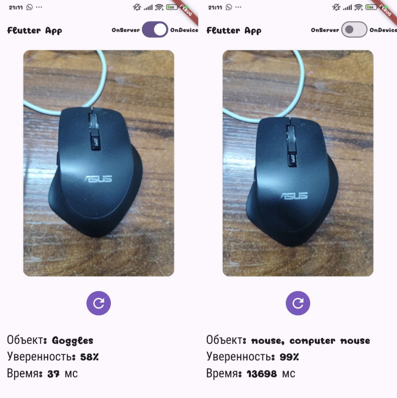

# AI Lens — On-Device vs Cloud ML Demo (Flutter) 📱🤖

This Flutter application is designed to demonstrate the architectural differences, performance trade-offs, and integration patterns between **On-Device** and **On-Server** Machine Learning models.

---

## 📱 Screenshots



---

# 🌟 Key Features

## Dual-Mode Inference
Seamlessly switch between on-device ML inference and cloud-based Hugging Face inference using a single UI toggle.

## Native ML Bridge
Uses Flutter Method Channels (Bridge) to communicate with native Android ML Kit code for on-device inference.

## Performance Metrics
Real-time measurement of inference latency to compare local device execution and remote cloud inference performance.

## Reactive UI
Built with Flutter using a modern declarative UI architecture.

## Optimized Networking
Efficient image compression and HTTP streaming for fast remote inference requests.

---

# 🛠 Tech Stack

## Core Flutter

- **Flutter** — Cross-platform UI framework.
- **Camera Plugin** — Camera preview and image capture.
- **Method Channels (Bridge)** — Communication between Flutter and native Android ML Kit code.
- **Material Design** — Modern UI components and design system.
- **Async / Future Processing** — Non-blocking background operations.

## Machine Learning

### On-Device
Google ML Kit inference executed through native Android code via Flutter Method Channels.

Because Dart is not designed for direct native ML execution, the application delegates local inference to platform-specific Android ML Kit implementations.

### On-Server
Hugging Face Inference API using the Vision Transformer (ViT) model for high-accuracy image classification.

## Networking

- **Dio** — HTTP client for API requests and image uploads.
- **Multipart Image Streaming** — Optimized image transfer.
- **JSON Serialization** — Efficient response parsing.

---

# 📊 Comparison: Local vs Server Inference

 | Feature             | ML Kit (On-Device)           | Hugging Face (On-Server)            |
|---------------------|------------------------------|-------------------------------------|
| Latency             | Very Low (~30–150ms)         | Higher (~1–2s depending on network) |
| Accuracy            | General Categories           | High-Precision / State-of-the-art   |
| Connectivity        | Offline                      | Requires Internet                   |
| Battery Usage       | Uses local CPU/GPU resources | Data Transfer Intensive             |
| Processing Location | Device Hardware              | Remote Cloud GPU                    |
| Speed Stability     | Very Stable                  | Depends on Network                  |
| Privacy             | Data stays on device         | Image sent to server                |
| Best Use Case       | Fast real-time detection     | More accurate classification        |

---

# 🏗 Architecture

Application flow:

```text
Flutter Camera -
Image Capture -
Compression Layer -
┣ On-Device Pipeline - Method Channel - Native Android ML Kit
┗ Remote Pipeline -Dio HTTP Client - Hugging Face API
```

---

# 🚀 Getting Started

## Prerequisites

- Flutter SDK
- Android Studio Ladybug or newer or Visual Studio
- Android device with camera support
- Hugging Face account
- Hugging Face API Token

---

# Installation

## Clone Repository

### GitHub

```bash
git clone https://github.com/RatRatatyu/mobile-ai-mvp/tree/main/flutter_mvp.git
```

### GitLab

```bash
git clone https://gitlab.com/RatRatatyu/mobile-ai-mvp/tree/main/flutter_mvp.git
```

---

# 🔑 Create Hugging Face API Token

To use the Inference API, you need to create a Hugging Face access token.

## Step 1 - Create Hugging Face Account

Go to:  
https://huggingface.co

Sign up for a new account or sign in with your existing one.

## Step 2 - Access Tokens

1. Click on your profile picture (top right corner).
2. Go to **Settings** → **Access Tokens**.

## Step 3 - Create New Token

Click the **New Token** button.

Set the following permissions:

- **Read access to contents of all public gated repos you can access**
- **Read access to contents of selected repos**
- **Inference - Make calls to the serverless Inference API**

> These permissions are required to access hosted inference models via the Hugging Face API.

## Step 4 - Copy Your Token

Your token will look similar to this:

```text
hf_xxxxxxxxxxxxxxxxxxxxxxxxx
```

## Step 5 — Add Token to Project

Add your token to the `api_model.dart` file :


"Authorization": "Bearer 'your_token'",


---

# 💡 Why This Project?

This project explores one of the key architectural questions in modern mobile AI systems:

> Should machine learning run directly on the device, or should inference be delegated to the cloud?

The application demonstrates the trade-offs between:

- inference latency
- response consistency
- model accuracy
- network overhead
- on-device vs remote processing

This project was created as an engineering demonstration for a conference to explore modern hybrid AI architecture patterns in mobile development.

---

# 📄 License

This project is licensed under the MIT License.